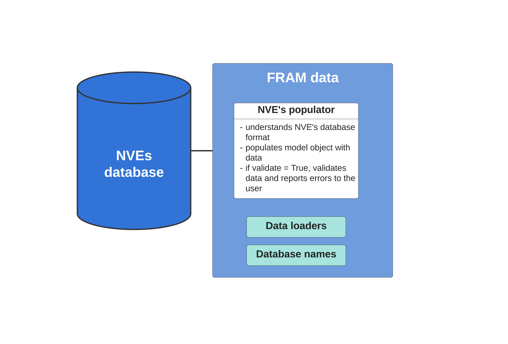

# Overview
FRAM data package is a part of [FRAM]({{ framlinks.fram }}){:target="_blank"} modelling framework developed by [the Norwegian Water Resources and Energy Directorate (NVE)]({{ framlinks.nve }}){:target="_blank"}. The package is responsible for connection between the database and the FRAM core package. It contains NVEs implementation of the Populator() class that populates the core model by translating the data from NVEs database into generic components so that the data can be further manipulated and sent to the power market model. 

## Installation
To install the data package, run `pip install fram-data`. But **we recommend**  that you rather start by installing our [simple demo]({{ framlinks.demo }}){:target="_blank"} to better understand how FRAM works.

## NVEs database
NVEs database is a folder with data files with folder structure, file format and table format defined by NVE. See [our demo database]({{ framlinks.dataset }}){:target="_blank"} as an example. NVEs database is model-neutral meaning that the same data can be used to build different energy market models.

FRAM is designed so that different users can use their own databases with file and table formats that suit them best. Than they need their own populator. 

## NVEs populator
NVEs implementation of the populator supports file formats and table formats in NVEs database. Populator must be implemented using the populator interface defined in [FRAM core]({{ framlinks.core }}){:target="_blank"}.

If you want to use your own database together with FRAM, you should create your own implementation of the populator. Use this package as an example.

